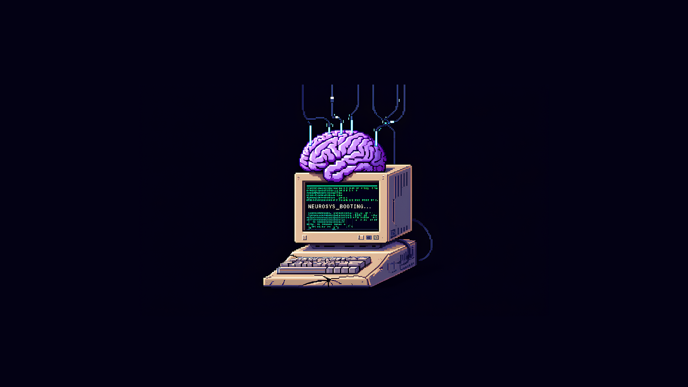

<p align="center">
  
</p>

<p align="center">
  <i>"Eu pecava, porque em vez de procurar em Deus os prazeres, as grandezas e as verdades, procurava-os nas suas criaturas: em mim e nos outros. Por isso precipitava-me na dor, na confusão e no erro."</i>
  <br>— Santo Agostinho
</p>


---

## 👨‍💻 About Me

```bash
> whoami
```

I'm known as **neurosys**, computer enthusiast. I'm especially interested in:

* 🧠 Reverse Engineering  
* ⚙️ Unix-like System's (x86)  
* 🔒 RedTeam  
* 🎮 GameHacking  
* 🐛 Malwares  
* 🏁 CTFs  

---

## 🧰 Technologies & Tools


---

## 📈 Git Statistics
<p align="center">
  
</p>

---

## 🔗 Links

* 🔗 [pwnbuffer.org](https://pwnbuffer.org)
* 🐦 [x.com](https://x.com/n3ur0sys)
